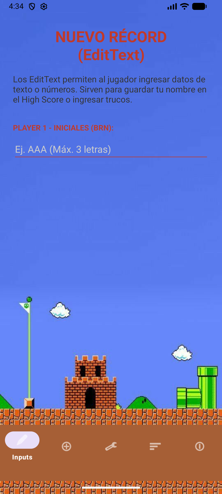
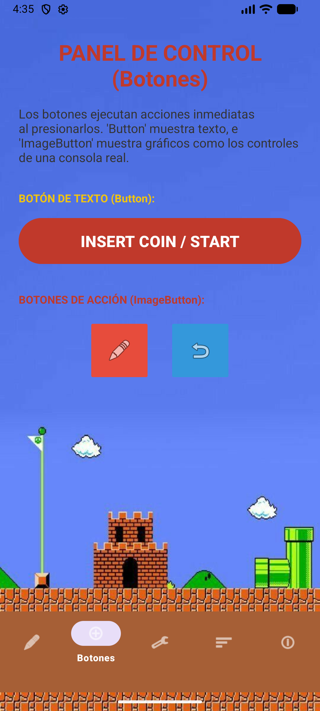
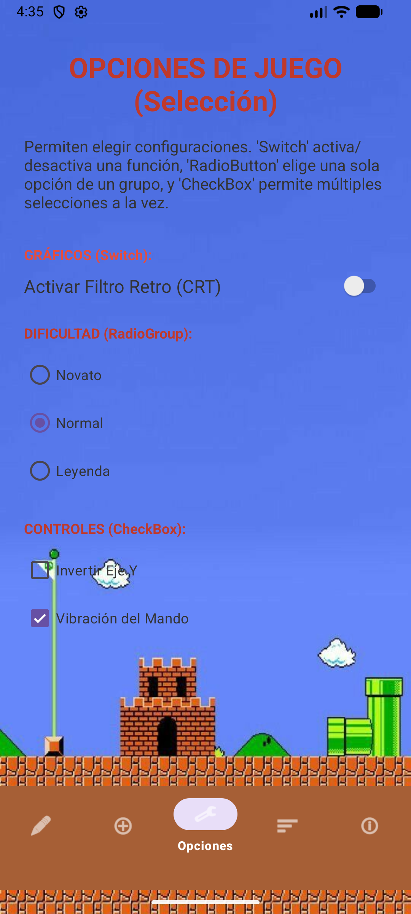
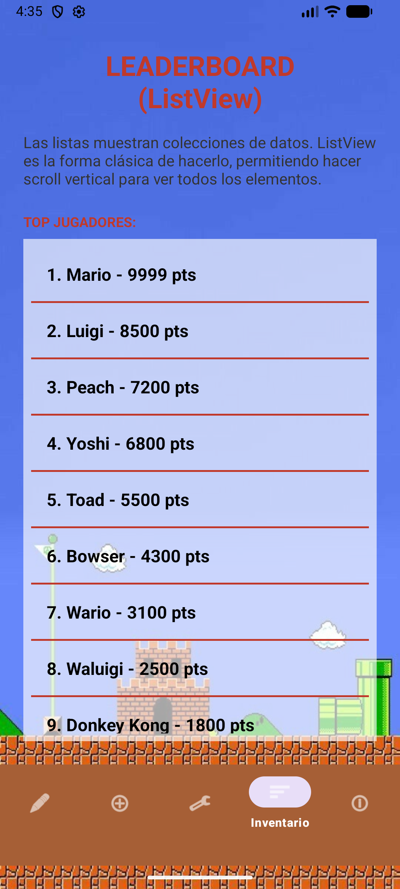
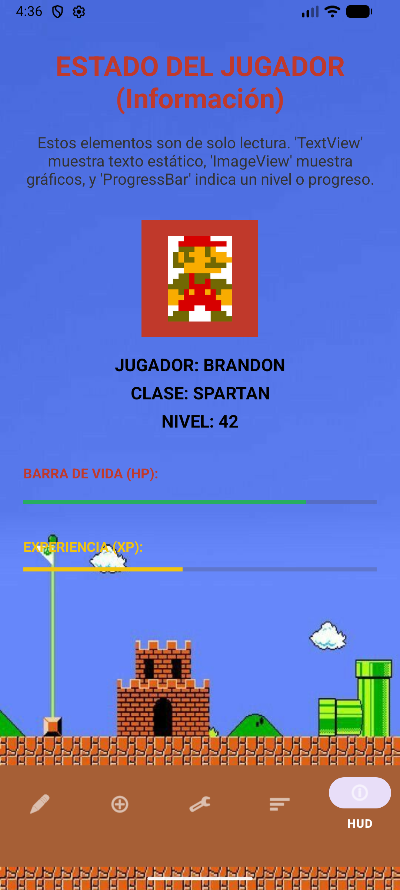

# Tarea 1: Elementos de Interfaz de Usuario en Android

## Descripción de la App
Esta es una aplicación Android desarrollada para demostrar el uso y funcionamiento de diferentes elementos de Interfaz de Usuario (UI) utilizando `Activities` y `Fragments`. La aplicación cuenta con una temática retro inspirada en Super Mario World y está estructurada en una actividad principal que actúa como contenedor para 5 diferentes fragmentos, navegables a través de un menú inferior (`BottomNavigationView`).

Cada fragmento explica y demuestra de forma interactiva una categoría específica de elementos de UI:
* **Inputs (EditText):** Campos para ingresar texto, contraseñas y números.
* **Botones:** Uso de `Button` clásico e `ImageButton` para acciones.
* **Selección:** Elementos para toma de decisiones como `Switch`, `RadioGroup/RadioButton` y `CheckBox`.
* **Listas:** Implementación de un `ListView` para mostrar una colección de datos (Leaderboard).
* **Información:** Elementos de solo lectura o indicadores de estado como `TextView`, `ImageView` y `ProgressBar`.

---

## Instrucciones de Uso
1. **Instalación:** Clona este repositorio y abre el proyecto en Android Studio.
2. **Ejecución:** Corre la aplicación en un emulador o dispositivo físico con Android.
3. **Navegación:** Al abrir la app, verás la pantalla de inicio (Inputs). Utiliza la barra de navegación en la parte inferior de la pantalla para cambiar entre los 5 apartados.
4. **Interacción:** * Escribe en los campos de texto de la primera pestaña.
   * Presiona los botones de acción para ver sus efectos visuales.
   * Enciende y apaga los interruptores y casillas de verificación en la pestaña de opciones.
   * Haz scroll en la pestaña de inventario/leaderboard para ver todos los elementos de la lista.

---

## Capturas de Pantalla (Evidencias)
Haz clic en cada sección para expandir y ver la captura de pantalla correspondiente (reducida a 250px de ancho):

  
📸 Ver captura: TextFields (Registro)

  

    
  

  
📸 Ver captura: Botones (Panel de Control)

  

    
  

  
📸 Ver captura: Selección (Opciones)

  

    
  

  
📸 Ver captura: Listas (Leaderboard)

  

    
  

  
📸 Ver captura: Información (HUD)

  

    
  

